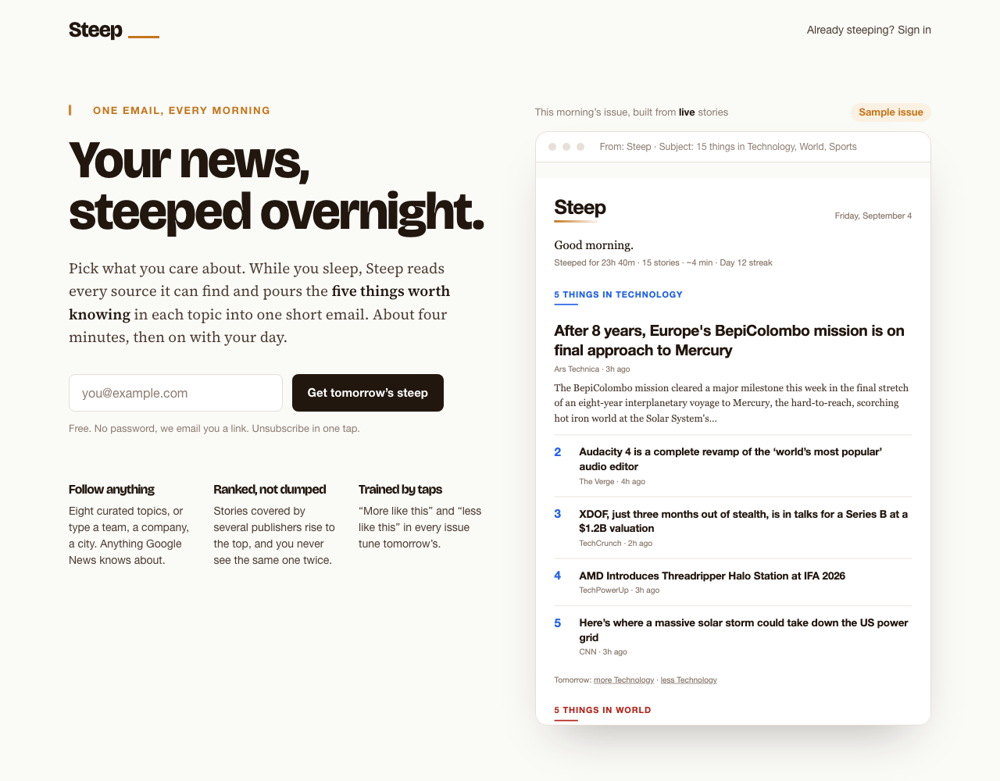
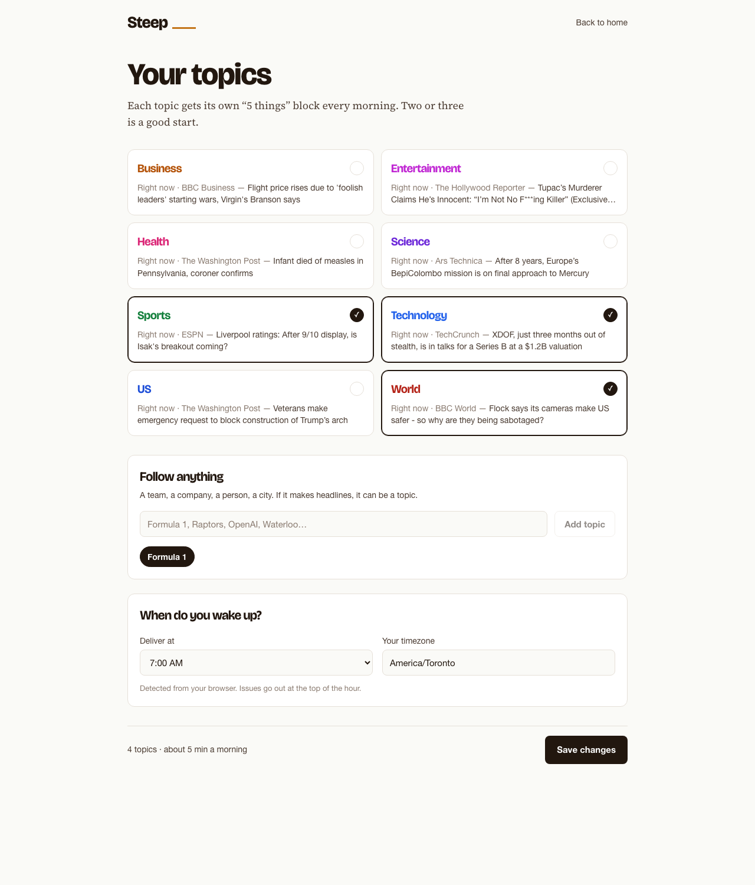
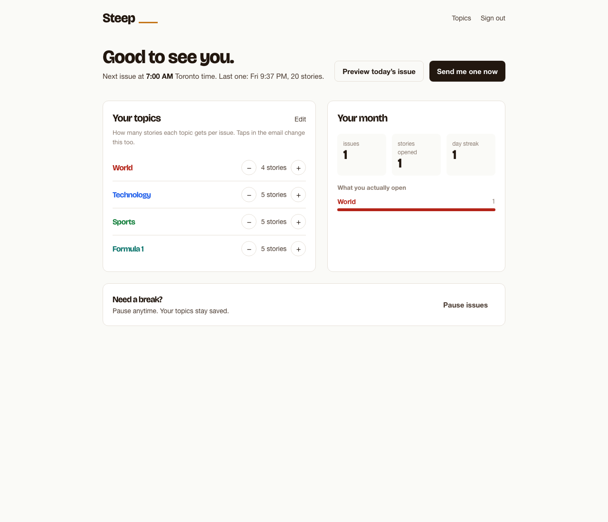

# Steep

**Your news, steeped overnight.** Pick a few topics, or follow anything, and every morning Steep emails you the five things worth knowing in each one. About four minutes, then on with your day.


## What it does

- **"5 things in {Topic}"** blocks: a lead story with image and blurb, then four ranked rows. Never the same story twice.
- **Follow anything.** Eight curated topics, plus custom ones ("Formula 1", "Raptors", "OpenAI") backed by Google News search feeds.
- **"Covered by N sources."** Stories reported by three or more publishers are detected by clustering headlines across sources and get a badge and a ranking boost. No LLMs involved.
- **Trained by taps.** "More like this / less like this" links in every issue change how many stories that topic gets tomorrow. Click tracking reorders topics by what you actually open and powers a "your month" page.
- **Morning, your time.** Each reader picks a wake-up hour and timezone. Issues are exactly-once per local day, even when the scheduler retries.
- **Instant first issue.** "Send my first steep now" so you never have to wait until tomorrow to see it.
- **Magic-link sign-in**, one-click unsubscribe (`List-Unsubscribe`), and no open-tracking pixel by design.

| Landing | Follow topics | Home |
| --- | --- | --- |
|  |  |  |

## How it works

```
                 cron-job.org (hourly)                     Resend
                       │                                     ▲
   POST /jobs/refresh  │   POST /jobs/send                   │ html + text
                       ▼                                     │
┌────────────────────────────────────────────────────────────┴───────────┐
│ Express 5 (TypeScript)                                                  │
│                                                                         │
│  feeds/   fetch → normalize → dedupe → cluster            digest/       │
│           Google News + publisher RSS                     build → rank  │
│                                                           → React Email │
│  engage/  /r/:id click redirect · /f more/less           jobs/          │
│  auth/    magic links · signed cookie session            sendDue tick   │
└────────────────────────────┬────────────────────────────────────────────┘
                             │ Drizzle
                             ▼
                       Postgres (Neon)
```

**Feeds.** Every topic has a Google News RSS feed (free, keyless, fresh) plus two or three hand-picked publisher feeds for better images and blurbs. Items are normalized (entities, "Headline - Publisher" suffixes, tracking params), deduplicated by canonical URL, and kept for 36 hours.

**Clustering.** Within a topic, headlines are tokenized and joined by union-find when their Jaccard similarity is at least 0.45 *and* they come from different publishers, so one outlet can't inflate a story. Cluster size feeds the ranking and the badge. See [`server/src/feeds/cluster.ts`](server/src/feeds/cluster.ts).

**Ranking.** `2·ln(sources) + recency + 0.5·hasImage`, one representative per cluster, at most one story per publisher while possible, lead is the best illustrated pick. See [`server/src/feeds/rank.ts`](server/src/feeds/rank.ts).

**Sending.** The hourly tick finds readers whose local hour equals their send hour and who have no issue for today's local date. The `digests` row is inserted *before* the email goes out, under a partial unique index on `(user, local_date)`, so a retried tick can't double-send. Job endpoints answer `202` immediately and finish the work with `waitUntil`, so a 30-second external cron timeout never cuts them off.

**Email.** React Email renders a 600px table layout with inline styles and a plain-text part. Preview it with `pnpm email:preview`.

## Run it locally

Requirements: Node 22, pnpm, Docker.

```bash
cp .env.example .env            # then set JWT_SECRET and CRON_SECRET (openssl rand -hex 32)
docker compose up -d            # Postgres on localhost:5433
pnpm install
pnpm db:migrate && pnpm db:seed # tables + the eight curated topics
pnpm feeds:refresh              # pull ~800 fresh stories
pnpm dev                        # API on :3000
pnpm --filter client dev        # Vite on :5173, proxies to :3000
```

Without `RESEND_API_KEY`, emails are written to `server/.preview/outbox/*.html` and the magic-link response includes a `devLink` so the whole flow works offline.

```bash
pnpm test        # vitest: clustering, ranking, feed parsing, email snapshot, timezone logic, signed links
pnpm lint && pnpm typecheck && pnpm build
```

Trigger the jobs by hand:

```bash
curl -X POST localhost:3000/jobs/refresh/sync -H "authorization: Bearer $CRON_SECRET"
curl -X POST localhost:3000/jobs/send/sync    -H "authorization: Bearer $CRON_SECRET"
```

## Deploy for free

Nothing free keeps a Node process alive for cron, so the scheduler is two HTTP endpoints hit by an external cron.

1. **Neon** (free): create a project, copy the *pooled* connection string as `DATABASE_URL`.
2. **Resend** (free, 100/day): create an API key. Verify a domain to send to anyone; without one you can only send to your own address from `onboarding@resend.dev`.
3. **Vercel** (Hobby): import the repo, set **Root Directory** to `server` and enable *Include files outside the root directory*. [`server/vercel.json`](server/vercel.json) builds the client into `server/public`, runs migrations and seeds. Env vars: `DATABASE_URL`, `RESEND_API_KEY`, `FROM_EMAIL`, `APP_URL`, `JWT_SECRET`, `CRON_SECRET`, `NODE_ENV=production`.
4. **cron-job.org** (free): two jobs with header `Authorization: Bearer <CRON_SECRET>`:
   - `POST https://<app>/jobs/refresh` at `0 * * * *`
   - `POST https://<app>/jobs/send` at `10 * * * *`

Hourly (not every 30 min) keeps Neon's free compute hours in budget. A long-lived host (Railway, a VPS with the [Dockerfile](Dockerfile)) runs the same jobs in-process with `node-cron` instead.

## Stack

Express 5 · TypeScript · Drizzle ORM + Postgres · React Email + Resend · rss-parser · Vite + React + Tailwind · Vitest · pnpm workspaces.

## Privacy

Steep records which links you open from your own issues to order your topics and show your stats. It does not embed a tracking pixel, so nobody knows whether you opened an email. Unsubscribe is one click and honored via `List-Unsubscribe` too.
